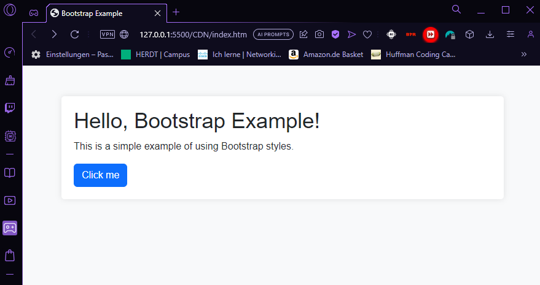
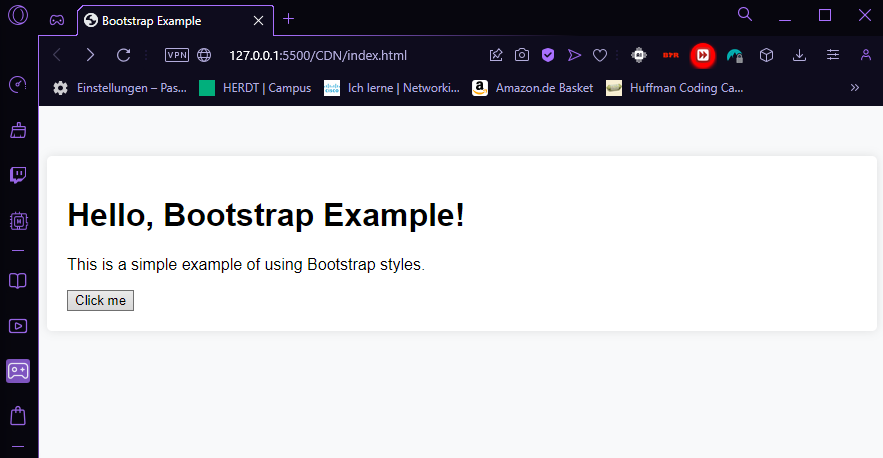

# CDN Beispiel mit HTML + CSS

### index.html
```HTML
<!DOCTYPE html>
<html lang="en">
<head>
  <meta charset="UTF-8">
  <meta name="viewport" content="width=device-width, initial-scale=1.0">
  <title>Bootstrap Example</title>
  <!-- Einbindung von Bootstrap über das CDN, entfernen bei live Demo -->
  <link href="https://cdn.jsdelivr.net/npm/bootstrap@5.3.0/dist/css/bootstrap.min.css" rel="stylesheet">
  <link rel="stylesheet" href="styles/main.css">
</head>
<body>
  <div class="container">
    <h1>Hello, Bootstrap Example!</h1>
    <p>This is a simple example of using Bootstrap styles.</p>
    <button class="btn btn-primary">Click me</button>
  </div>
</body>
</html>
```
### main.css
```CSS
body {
    font-family: Arial, sans-serif;
    background-color: #f8f9fa;
  }
  .container {
    padding: 20px;
    margin-top: 50px;
    background-color: white;
    border-radius: 5px;
    box-shadow: 0px 0px 10px rgba(0, 0, 0, 0.1);
  }
```

## Preview with Bootstrap


## Preview without Bootstrap

