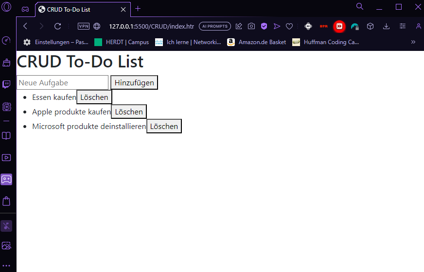

# CDN Beispiel mit HTML + CSS

### index.html
```HTML
<!DOCTYPE html>
<html lang="en">
<head>
  <meta charset="UTF-8">
  <meta name="viewport" content="width=device-width, initial-scale=1.0">
  <title>CRUD To-Do List</title>
  <link href="https://cdn.jsdelivr.net/npm/bootstrap@5.3.0/dist/css/bootstrap.min.css" rel="stylesheet">
  <style>
    .completed {
      text-decoration: line-through;
    }
  </style>
</head>
<body>
  <h1>CRUD To-Do List</h1>

  <input type="text" id="taskInput" placeholder="Neue Aufgabe">
  <button onclick="addTask()">Hinzufügen</button>

  <ul id="taskList">
    <!-- Aufgaben werden hier dynamisch eingefügt -->
  </ul>

  <script src="script.js"></script>
</body>
</html>
```
### script.js
```js
// Array zur Speicherung der Aufgaben
let tasks = [];

// Funktion zum Hinzufügen einer neuen Aufgabe
function addTask() {
  const taskInput = document.getElementById("taskInput");
  const taskText = taskInput.value.trim();
  if (taskText !== "") {
    tasks.push(taskText);
    taskInput.value = "";
    updateTaskList();
  }
}

// Funktion zum Anzeigen der Aufgaben
function updateTaskList() {
  const taskList = document.getElementById("taskList");
  taskList.innerHTML = "";

  tasks.forEach((task, index) => {
    const taskItem = document.createElement("li");
    taskItem.textContent = task;

    const deleteButton = document.createElement("button");
    deleteButton.textContent = "Löschen";
    deleteButton.onclick = () => deleteTask(index);

    taskItem.appendChild(deleteButton);
    taskList.appendChild(taskItem);
  });
}

// Funktion zum Löschen einer Aufgabe
function deleteTask(index) {
  tasks.splice(index, 1);
  updateTaskList();
}

// Initialisierung beim Laden der Seite
window.onload = updateTaskList;
```

## Preview with Tasks
